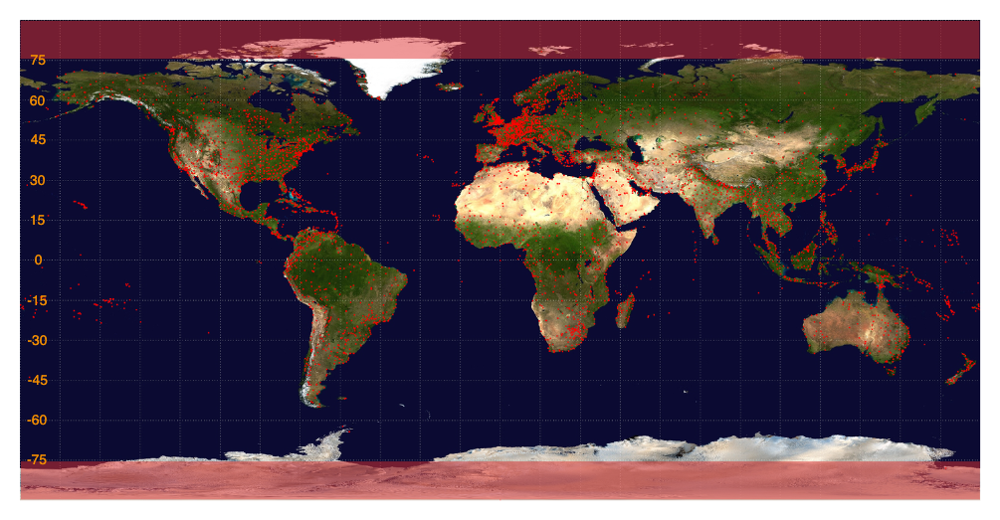

# Flight Connections

[](https://github.com/antivoland/transporeon-test/actions/workflows/build.yml)

Check the task description [here](TASK.md). We need to find a route between two airports having no more than three intermediate stops. And the bonus part will be to allow short ground runs between stops no longer than 100 km.

I [started](https://github.com/antivoland/transporeon-test/tree/typescript) with the implementation using TypeScript, but soon realized that I would not be able to meet the deadline amid other ongoing interview processes. So I've decided to focus on the solution using Java.

## Datasets

I've found suitable [datasets](https://openflights.org/data.html) at openflights.org:
* [airports.dat](src/main/resources/data/airports.dat) having the following structure:
  * **Airport ID**, unique OpenFlights identifier for this airport
  * **Name**, name of airport
  * **City**, main city served by airport
  * **Country**, country or territory where airport is located
  * **IATA**: 3-letter IATA code (null if not assigned/unknown)
  * **ICAO**, 4-letter ICAO code (null if not assigned)
  * **Latitude**, decimal degrees, usually to six significant digits (negative is South, positive is North)
  * **Longitude**, decimal degrees, usually to six significant digits (negative is West, positive is East)
  * **Altitude**, altitude in feet
  * **Timezone**, hours offset from UTC
  * **DST**, daylight savings time
  * **Tz database time zone**, timezone in "tz" (Olson) format (eg. "America/Los_Angeles")
  * **Type**, type of the airport (only type=airport is used)
  * **Source**,	source of this data
* [routes.dat](src/main/resources/data/routes.dat), which are directional (if an airline operates services from A to B and from B to A, both A-B and B-A are listed separately) and have the structure described below:
  * **Airline**, 2-letter (IATA) or 3-letter (ICAO) code of the airline
  * **Airline ID**, unique OpenFlights identifier for airline (see Airline)
  * **Source airport**, 3-letter (IATA) or 4-letter (ICAO) code of the source airport
  * **Source airport ID**, Unique OpenFlights identifier for source airport
  * **Destination airport**, 3-letter (IATA) or 4-letter (ICAO) code of the destination airport
  * **Destination airport ID**, unique OpenFlights identifier for destination airport
  * **Codeshare**, "Y" if this flight is a codeshare (that is, not operated by Airline, but another carrier), empty otherwise
  * **Stops**, number of stops on this flight ("0" for direct)
  * **Equipment**, 3-letter codes for plane type(s) generally used on this flight, separated by spaces

These datasets are widely used, [here](https://www.kaggle.com/datasets/elmoallistair/airlines-airport-and-routes?select=airports.csv) and [here](https://www.kaggle.com/datasets/elmoallistair/airlines-airport-and-routes?select=routes.csv) you'll find some stats for each field.

## Segmentation

Calculating the distance between two points is a rather expensive operation. For a dataset of more than 7000 airports, a brute force method to determine all ground routes between airports within a radius of 100 km can take a minute. This is a bit annoying as I would also like to use datasets not only at runtime but also in tests. 

So let's split the Earth into segments as follows:


Here are the airports' distribution:



## Run

You'll need to build (prerequisites are Maven and 17th Java):

```shell
make build
```

And then run the application server as follows:

```shell
make run
```